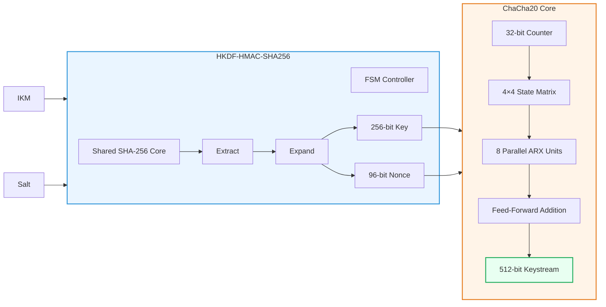

# HKDF_ChaCha20_Key_Generation
An IEEE-selected, highly optimized RTL implementation of a complete key derivation and stream cipher pipeline, written in  Verilog and verified against the NIST SP 800-22 statistical randomness suite.

# HKDF-ChaCha20 Cryptographic Hardware Pipeline ⚡🛡️

A high-throughput, RTL-level unified pipeline implementing cryptographic key derivation (**HKDF-HMAC-SHA256**) and symmetric stream encryption (**ChaCha20**) in pure spatial hardware. 

Designed for high-speed network protocols like **TLS 1.3** and **WireGuard**, this architecture eliminates software buffering overhead and memory-bus side channels by fusing key generation and stream ciphering into a single continuous hardware datapath.

---

## 🌟 Architecture Highlights

In software, HKDF and ChaCha20 operate as isolated, sequential functions passing data through OS-managed memory buffers. This implementation completely bypasses CPU cycles with a **pure hardware-handoff architecture**:

* **Zero-Latency Handoff:** The HKDF Engine natively extracts and expands the 256-bit Key and 96-bit Nonce, feeding them directly into the ChaCha20 matrix via dedicated hardware buses. No software stack or DMA transfer required.
* **Massive Parallelism (ARX Engine):** Rather than iteratively reusing a single Add-Rotate-Xor (ARX) block, the ChaCha20 core instantiates **8 parallel ARX processing elements**, executing a full double-round every clock cycle.
* **High-Volume Key Streams:** Integrates a native 32-bit hardware block counter allowing a single derived key to dynamically stream up to **256 Gigabytes** of continuous, cryptographically secure keystream.

---

## 🏗️ Hardware Architecture & Datapath

The design combines **HKDF-HMAC-SHA256** and **ChaCha20** into a unified RTL pipeline, enabling secure key derivation and keystream generation without software intervention or intermediate memory transfers.

### 🔹 HKDF Engine

The HKDF module derives cryptographic parameters from the **Input Keying Material (IKM)** using a **shared SHA-256 core** controlled by an FSM. By reusing a single hashing engine for all HMAC operations, the architecture minimizes FPGA resource utilization while implementing the standard **Extract–Expand** process.

* **Extract:** Generates a 256-bit **Pseudorandom Key (PRK)**.
* **Expand:** Produces the **256-bit encryption key** and **96-bit nonce**.

The derived key and nonce are transferred directly to the ChaCha20 core through dedicated hardware registers.

### 🔹 ChaCha20 Engine

The ChaCha20 core initializes its **4×4 state matrix** using the constants, derived key, nonce, and a 32-bit block counter. Eight parallel **ARX (Add–Rotate–XOR)** units execute the column and diagonal Quarter-Rounds simultaneously, completing one **Double Round per clock cycle**.

After **20 rounds (10 Double Rounds)**, the original state is added to the transformed state to generate a **512-bit keystream block**. The counter increments automatically, allowing continuous high-throughput keystream generation.

### Module Breakdown

* `sha256.v` & `hmac_sha256.v`: Custom SHA-256 hash engine utilizing a 512-bit message buffer with multi-block chaining logic.
* `hkdf.v`: Strict finite state machine (FSM) realizing the RFC 5869 **Extract-and-Expand** paradigm.
* `chacha20.v`: The core streaming engine, unrolled to process a full 512-bit block matrix transformation every 12 clock cycles.

---

## 🧪 Cryptographic Verification & Randomness Proof

Writing cryptographic primitives in hardware is unforgiving. To guarantee absolute mathematical alignment with structural software specs and prove statistical unpredictability, this RTL was verified through two strict testing suites:

### 1. RFC 7539 Known Answer Tests (KAT)
The hardware pipeline output was cross-examined against standard software test vectors. The RTL output achieves a **100% bit-for-bit match** for standard input vectors.

### 2. NIST SP 800-22 Statistical Test Suite
A continuous keystream sample of **1,200,000 bits** was generated straight from the Vivado simulator behavioral wave output and fed into the NIST suite. 

* **Output Bit Balance:** 50.04% Ones / 49.96% Zeros (Statistically indistinguishable from pure hardware noise).
* **Significance Level ($\alpha$):** 0.01

| NIST Statistical Test | P-Value | Status |
| :--- | :--- | :--- |
| **Frequency (Monobit)** | 0.371673 | ✅ PASS |
| **Block Frequency** | 0.573638 | ✅ PASS |
| **Runs Test** | 0.153211 | ✅ PASS |
| **Longest Run of Ones** | 0.622645 | ✅ PASS |
| **Discrete Fourier Transform (Spectral FFT)** | 0.253194 | ✅ PASS |
| **Serial Test** | 0.364410 | ✅ PASS |
| **Approximate Entropy** | 0.917923 | ✅ PASS |

---
## Author

**Charunivethitha S**  
Electronics and Communication Engineering (ECE)  
Hardware Security • FPGA Design • VLSI

